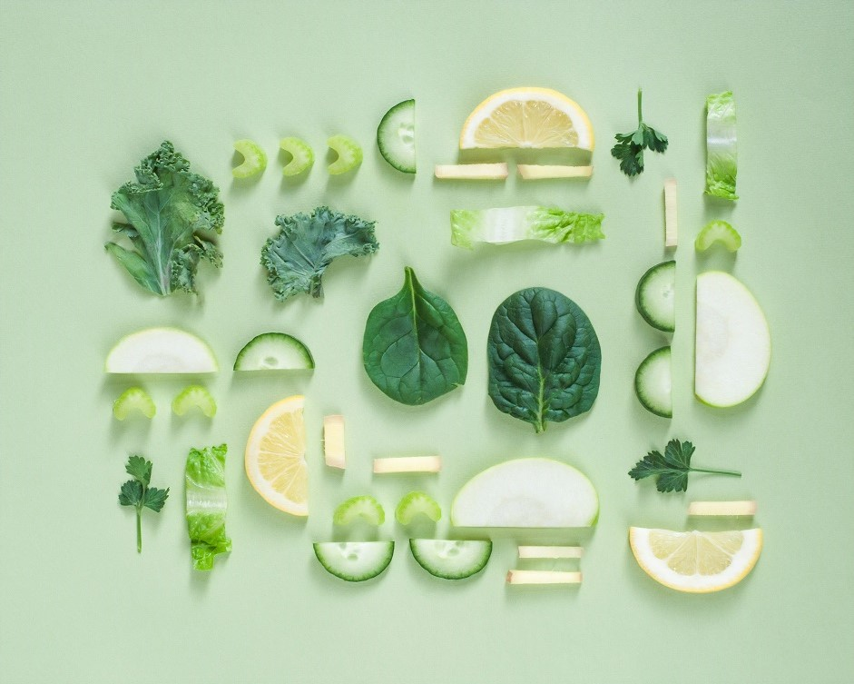

# *Smart Foodie*
*********************************************************
 
    The Smart Foodie app aims to help the average consumer minimize the amount of food that they waste. 
    It not only tracks purchases, but also notifies the user if a certain item is about to spoil. 
    Smart Foodie’s capabilities even include suggesting recipes based on the items a user has in stock.
    
  
  

  

